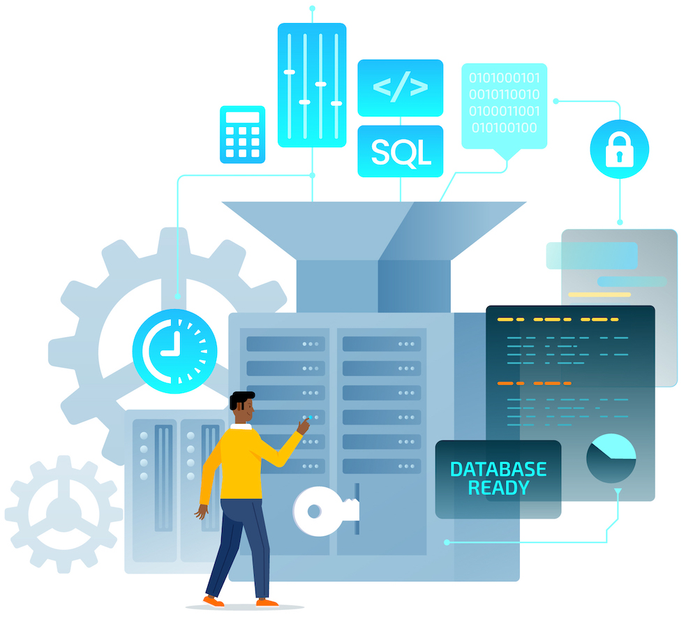
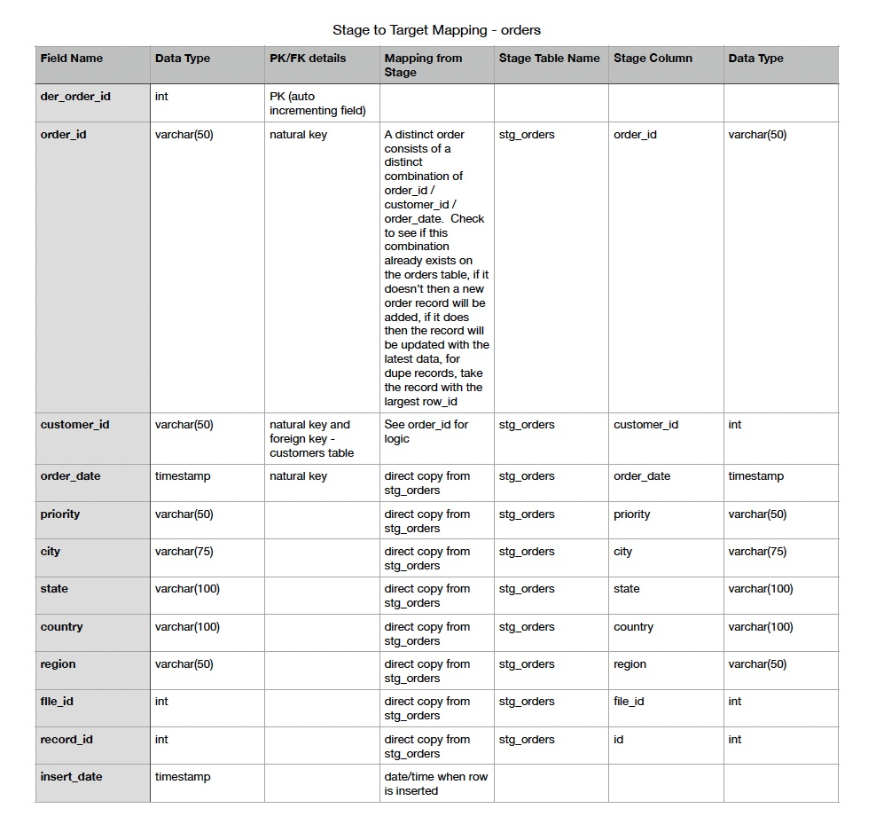

# ETL and Business Intelligence Project - Walmart Sales Data

By: Liz Wilson
February 20, 2024

## *Analyzing, Modeling, and Finding Answers*

Image by <a href="https://www.freepik.com/free-vector/hand-drawn-flat-design-sql-illustration_21901977.htm#query=sql&position=2&from_view=search&track=sph&uuid=b4892228-dd0b-4589-932d-33d3a7663bc1">Freepik</a>

## The Project
The goal of this project is to demonstrate the ETL process for loading a file into a staging table and then loading the data from stage to target tables.  SQL will be executed to understand the dataset and the level of granularity of each piece of data. Source to Target documentation will be created that will outline how the data will flow into each table.  A data model will also be created which will include the target tables and will show the relationships between the tables.  The data will be loaded to a PostgreSQL database.  Aggregate views will be created using SQL.  Questions will be posed and the views will be pulled into Pandas dataframes and visualizations will be created in order to answer the questions.  The dataset is a sales dataset with order, customer, and product information.    

The project is contained within this [Jupyter Notebook](walmart_analysis.ipynb).  The data will be imported from Kaggle, saved as a Pandas data frame, and various libraries will be utilized to accomplish the analysis, SQL queries, and visualizations. You may be asking yourself why I didn't just execute SQL queries directly from the original dataset (and this is a good question).  I wanted to demonstrate the ETL process that would most likely occur in the real world when a new file needs to be ingested and transformed in such a way that the transformed data can easily be utilized to answer business questions.

### The Dataset
The data is from [Kaggle](https://www.kaggle.com/datasets/anandaramg/global-superstore) and it consists of one file with 51,290 rows of sales data from Walmart.  Walmart, the world's largest retail corporation, is a multinational conglomerate known for its extensive chain of hypermarkets, discount department stores, and grocery stores, offering a diverse range of products and services.

### Extract
#### Loading the data to a stage table 
The data was loaded without any transformation to a PostgreSQL database staging table.  [This SQL](load_staging_table.sql) was used to load the stage table.  

#### Understanding the data
First, I determined what constitutes a customer, a product, and an order.  

Natural Keys for the critical segments of the dataset (along with other learnings revealed through the initial data analysis):
* Customer: `customer_id`
* Product: `product_id` and `product_name` (product names are not consistent across a given `product_id`)
* Order: `order_id`, `customer_id`, and `order_date` (different customers can order under the same `order_id` and the same customer can order on different dates with the same `order_id`)
* Shipping: I couldn't find quite the right natural key for this (there wasn't an obvious key like `shipping_id`) so I decided to store it at the order/product level even though there will be a handful of dupes that will be introduced this way.  This would be a good area to fix as a future enhancement.  Additional understanding of the data would be critical to set this up correctly.

Next I had to understand the sample data in each field and determine the data type that would be used for each. I also had to determine what level of granularity of each field. Since the documentation for this data was minimal, many queries were run to try to determine this as accurately as possible (an SME would have been invaluable here).  Several staging fields were excluded from the target tables because either the field didn't contain much valuable information or it was some kind of derived field (that we could derive later if needed).  The SQL used for these queries can be viewed [here](data_analysis.sql).

### Data Model
Next, the data model was created.  It seemed logical to have a customers table, a products table, an orders table, and then a join table which would bring together orders and products. Auto incrementing primary keys were utilized for the orders, orders_products, and products tables since they all had composite keys.

### Source to Target Documentation
The [Source to Target documentation](assets/STT.pdf) contains the transformation logic that will happen when loading the data to the Stage table and then to the Target tables.  In a normal production environment we would need additional meta tables to support files being loaded on a regular basis and additional logic and database fields would be needed.

### Transform and Load
#### Loading from Stage to Target
The target tables were loaded using the SQL in [this file](load_db.sql).  When loading ALL tables, when dupes are found, take the record that appears latest in the file.  

Loading the customers Table:
* Find all the unique customers (by customer_id which was determined to be the key for a customer)

Loading the orders Table:
* Find all the unique orders (by order_id/customer_id/order_date which was determined to be the key for an order)

Loading the products Table:
* Find all the unique products (by product_id/product_name)

Loading the orders_products Table:
* Find all the unique order/product combinations (order_id, customer_id, order_date, product_id, product_name)

If this were an ongoing file that would need to be processed we would want to consider adding the following logic:
* Add logic to check to see if the customer or order or product already exists in the table.  If so then update the record instead of inserting a new record.  
* Add audit fields with the insert and update dates as well as insert and update user IDs or job IDs for better traceability and research purposes.

#### Loading the Aggregate Views
Aggregate views were created from the target tables to help with the creation of visualizations.  The SQL used is in [this file](agg_views.sql).

Market Level:
This view will help us to understand the sales performance of the various markets.

Customer Level:
This view will allow us to see which customers have the highest sales.

Product Level:
This view allows us to see the quantity of products being sold and the profitability of each product.

### Business Intelligence
The Python library psycopg2 was utilized to query the PostgreSQL database from Jupyter Notebook.  The aggregate tables were queried and stored in Pandas dataframes. Questions were posed and Matplotlib and seaborn were utilized to create visualizations to find answers.  Sample visualizations:

